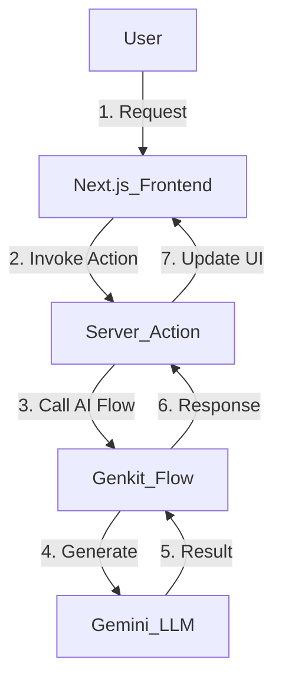

# Sahayak AI: Hackathon Pitch Deck

---

### **Slide 1: Title Slide**

**Sahayak AI: Your AI-Powered Teaching Assistant**

**Tagline:** Freeing India's Teachers, Empowering its Students.

**Team Name:** [आपकी टीम का नाम यहाँ डालें]

---

### **Slide 2: The Problem 😟**

**The Overburdened Indian Teacher**

*   **50% of Time on Non-Teaching Tasks:** Teachers spend countless hours on administrative work instead of teaching.
*   **Repetitive Tasks:** Lesson planning, creating question papers, and grading assignments lead to burnout.
*   **One-Size-Fits-All Content:** Lack of hyper-local and multilingual content fails to engage students from diverse backgrounds.
*   **The Result:** Reduced teaching quality, lower student engagement, and a stressed education system.

---

### **Slide 3: Our Solution ✨**

**Introducing Sahayak AI: A Teacher's True "Sahayak" (Assistant)**

Sahayak AI is an intelligent, multi-lingual platform that automates repetitive tasks and empowers educators to create personalized, engaging learning experiences.

**We give teachers back their most valuable asset: TIME.**

*   **Automate:** Handle administrative heavy lifting.
*   **Personalize:** Create content that connects with every student.
*   **Engage:** Make learning fun and interactive.

---

### **Slide 4: Key Features (Live Demo)**

**A Suite of Intelligent Tools:**

1.  **AI Lesson Planner:** Generate comprehensive weekly lesson plans in minutes.
2.  **Paper Digitizer:** Convert any physical paper into an editable digital document with a single click.
3.  **Hyper-Local Content:** Create stories and examples in regional languages using local context.
4.  **Quiz & Rubric Generator:** Instantly build assessments and fair grading rubrics.
5.  **Visual Aids Generator:** Create simple drawings, charts, and diagrams to explain complex topics.
6.  **Centralized Workspace:** A single hub to organize all generated content and resources.

---

### **Slide 5: How It Works (Tech Stack)**

**Built on a Modern, Scalable, and Secure Stack:**

*   **Frontend:** **Next.js (App Router)**, React, Tailwind CSS
    *   *Why?* For a high-performance, server-driven UI that is fast and responsive.
*   **AI Backend:** **Genkit (on Firebase)**
    *   *Why?* Provides a durable and scalable framework for defining and running our powerful AI flows.
*   **Database & Auth:** **Cloud Firestore & Firebase Authentication**
    *   *Why?* Ensures a secure, real-time, and scalable multi-tenant architecture to protect user data.

---

### **Slide 6: Target Audience & Market Size**

**A Vast and Underserved Market:**

*   **Primary Audience:** K-12 Teachers in India (~9.5 Million)
*   **Secondary Audience:** K-12 Students in India (~260 Million)
*   **Market:** The Indian EdTech market is projected to reach **$10.4 billion by 2025**.
*   **Our Focus:** We are targeting the segment focused on teacher enablement and classroom efficiency, which is currently underserved.

---

### **Slide 7: Business Model**

**A Freemium Model to Drive Adoption:**

| Plan         | Price (INR)      | Target User                 | Key Feature                               |
|--------------|------------------|-----------------------------|-------------------------------------------|
| **Basic**    | Free             | Individual Teachers/Students| Limited access to all basic tools         |
| **Pro**      | ₹499 / month     | Power Users                 | Unlimited core tools, 100 premium credits |
| **Institute**| Custom Pricing   | Schools & Institutions      | All features, admin dashboard, support    |

*Our model allows for widespread adoption through the free tier while generating revenue from power users and institutions.*

---

### **Slide 8: What's Next (Future Roadmap)**

**Building a Complete Educational Ecosystem:**

*   **Phase 1 (Done):** Core AI tools for teachers & platform foundation.
*   **Phase 2: Student & Parent Portals**
    *   Enable assignment submission and grade tracking for students.
    *   Provide a communication bridge between parents and teachers.
*   **Phase 3: Advanced Analytics & Insights**
    *   Dashboards for school admins to track learning outcomes.
*   **Phase 4: AI Voice Assistant**
    *   Integrate a hands-free voice assistant for navigation and commands within the app.

---

### **Slide 9: The Team**

*[This is a placeholder. आप यहाँ अपनी टीम के सदस्यों के नाम, भूमिकाएँ और तस्वीरें जोड़ सकते हैं।]*

*   **[Your Name]** - Full Stack & AI Lead
*   **[Teammate's Name]** - UI/UX & Frontend Lead
*   **[Teammate's Name]** - Business & Strategy Lead

**We are a passionate team dedicated to solving real-world problems in Indian education.**

---

### **Slide 10: Thank You!**

**Sahayak AI**

**Join us in our mission to empower every teacher and inspire every student in India.**

**Questions?**

**Website:** sahayak.ai (demo)
**Contact:** [आपकी ईमेल आईडी]
