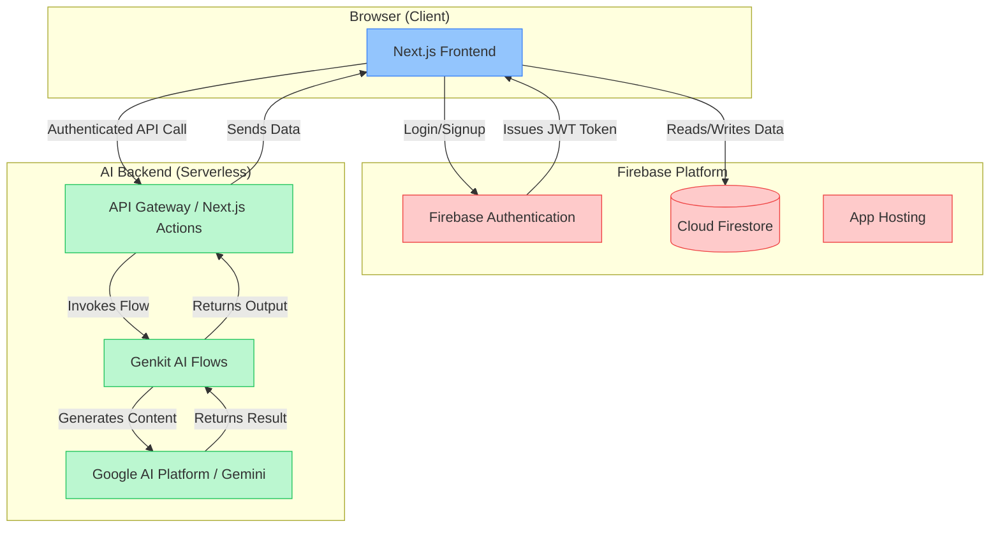

# Sahayak AI - System Design Document (SDD)

**Version:** 1.0  
**Status:** Baseline  
**Author:** Chief Architect

---

### 📘 1. System Overview

Sahayak AI is envisioned as a multi-tenant, AI-driven SaaS platform meticulously designed to serve the Indian education ecosystem. The platform's primary objective is to empower educators by automating administrative and academic tasks, thereby enabling them to reclaim valuable time and elevate their teaching quality.

The system will provide role-based access control (RBAC) to cater to the distinct needs of Super Admins, School Admins, Teachers, Students, and Parents, ensuring data isolation and a tailored user experience for each role. At its core, the platform will leverage a suite of generative AI tools to assist with content creation, assessment, and communication.

---

### ⚙️ 2. Core Features & Functional Requirements

-   **Multi-Tenancy:** Each school's data must be logically isolated within a shared infrastructure. A `schoolId` will be the primary key for data segregation.
-   **Role-Based Access Control (RBAC):**
    -   **Super Admin:** Manages the entire platform, including school onboarding and subscription management.
    -   **School Admin:** Manages a single school's users, classes, subjects, and announcements.
    -   **Teacher:** Manages their assigned classes, including attendance, assignments, and AI tool usage.
    -   **Student & Parent:** View-only access to their specific data (timetables, grades, etc.).
-   **AI-Powered Tools Suite:**
    -   **Content Generation:** Lesson Plans, Quizzes, Visual Aids, Hyper-Local Content, Stories.
    -   **Assessment:** Rubric Generation, Paper Digitization, Answer Evaluation.
    -   **Communication:** Parent Email Drafting.
-   **User & Academic Management:** Onboarding users, creating classes/sections, and managing subjects.
-   **Workspace & Library:** Personal space for users to save and organize generated assets and resources.

---

### 🧩 3. Tech Stack Recommendation

-   **Frontend:** Next.js (App Router), React, TypeScript, Tailwind CSS, ShadCN UI.
    -   *Justification:* Chosen for its high performance with Server Components, robust framework for web applications, and excellent developer experience. This is our default stack.
-   **Backend (AI & Business Logic):** Genkit (on Node.js/Firebase Functions).
    -   *Justification:* Genkit provides a durable, serverless framework for defining and running AI flows, which is perfect for our modular tool-based architecture.
-   **Database:** Cloud Firestore.
    -   *Justification:* A NoSQL, document-based database that offers excellent scalability, real-time capabilities, and a flexible schema suitable for our multi-tenant model.
-   **Authentication:** Firebase Authentication.
    -   *Justification:* Provides a secure, easy-to-use authentication system with built-in providers (Google, Email/Password) and integrates seamlessly with Firestore security rules.
-   **Hosting:** Firebase App Hosting & Firebase Functions.
    -   *Justification:* A fully managed, serverless platform that simplifies deployment and scaling, allowing us to focus on development.

---

### 🧠 4. System Architecture

The architecture is designed to be a scalable, serverless, and modular system.



**Description:**
1.  **Frontend (Next.js):** The user interacts with the React-based frontend hosted on Firebase App Hosting. All UI components are rendered here.
2.  **Authentication:** When a user signs in, Firebase Authentication verifies their identity and issues a JWT. This token is attached to all subsequent requests to prove their identity and role.
3.  **Database Interaction:** The frontend directly and securely communicates with Firestore for most data read/write operations (e.g., fetching a lesson plan). Firestore Security Rules enforce that a user can only access data for their own school and role.
4.  **AI Operations:** For AI-related tasks, the frontend calls a Next.js Server Action, which acts as a secure gateway. This action invokes the appropriate Genkit AI flow.
5.  **Genkit AI Flows:** These are serverless functions that contain the core logic for interacting with the LLM (e.g., the prompt for generating a quiz).
6.  **LLM Interaction:** The Genkit flow sends the request to the underlying Large Language Model (e.g., Gemini) and gets the result.
7.  **Data Flow Back:** The result is passed back through the chain (LLM -> Genkit -> Server Action -> Frontend) and displayed to the user.

---

### 🗂️ 5. Database Schema (Firestore)

A multi-tenant model is critical. All school-specific data will be nested under a top-level `schools` collection.

-   **`users/{userId}`** (Top-level)
    -   `uid` (from Firebase Auth)
    -   `email`, `displayName`, `photoUrl`
    -   `role`: 'super-admin' | 'school-user'
    -   `schoolId`: (string, *if role is 'school-user'*) - *Crucial for security rules.*

-   **`schools/{schoolId}`**
    -   `schoolName`, `address`, `subscriptionTier` ('basic', 'pro', 'institute')
    -   **Sub-collections:**
        -   **`members/{userId}`**: Stores profiles of all users *within* that school.
            -   `role`: 'admin' | 'teacher' | 'student' | 'parent'
            -   `name`, `email`
        -   **`classes/{classId}`**: Represents a class.
            -   `name` (e.g., "Grade 10"), `section` (e.g., "A")
        -   **`subjects/{subjectId}`**:
            -   `name`, `classId`
        -   **`students/{studentId}`**:
            -   `userId`, `classId`, `rollNumber`
        -   **`teachers/{teacherId}`**:
            -   `userId`, `assignedClasses: [classId]`
        -   **`announcements/{announcementId}`**:
            -   `title`, `content`, `authorId`, `timestamp`

---

### 🚀 6. APIs & Data Flow

We will primarily use Next.js Server Actions for backend communication, especially for invoking AI flows. This simplifies the architecture by removing the need for a separate API layer.

**Example Flow: Generating a Lesson Plan**

1.  **Client (`LessonPlannerPage.tsx`):** User fills a form with topic, grade, etc., and clicks "Generate".
2.  **Server Action (`actions/generate-lesson-plan.ts`):** The form data is sent to this server-side function. It validates the input.
3.  **Genkit Flow (`ai/flows/generate-lesson-plan.ts`):** The Server Action calls the `generateLessonPlan` flow with the validated data.
4.  **LLM Call:** The flow formats the data into a prompt and sends it to the Gemini model.
5.  **Response:** The LLM returns a JSON string containing the lesson plan.
6.  **Return to Client:** The response is passed back to the Server Action, which returns it to the client component.
7.  **UI Update:** The client component receives the lesson plan and updates the UI to display it.

---

### 🛡️ 7. Security & Authentication Plan

-   **Authentication:** Firebase Authentication will manage user identities. All access will require a valid JWT.
-   **Authorization (Firestore Security Rules):** This is the cornerstone of our multi-tenant security.
    -   Rules will be written in `firestore.rules` to enforce strict data access.
    -   **Example Rule:** A teacher can only read/write documents within their own `schools/{schoolId}` document. This is checked by matching `request.auth.uid` with the `schoolId` stored in their top-level `users/{userId}` profile.
        ```
        match /schools/{schoolId}/{document=**} {
          allow read, write: if get(/databases/$(database)/documents/users/$(request.auth.uid)).data.schoolId == schoolId;
        }
        ```
-   **API Security:** Server Actions in Next.js run on the server, preventing exposure of sensitive logic or API keys to the client. All Genkit flows are backend-only.
-   **Input Validation:** Zod will be used for schema validation on all inputs to Server Actions to prevent injection attacks.

---

### 📈 8. Scalability, Performance & Caching

-   **Scalability:** The entire stack (Firebase App Hosting, Functions, Firestore) is serverless and auto-scaling. It will handle traffic spikes without manual intervention.
-   **Performance:**
    -   **Next.js:** Server Components reduce the amount of JavaScript shipped to the client, leading to faster initial page loads.
    -   **Firestore:** Real-time listeners provide fast UI updates. Query performance can be optimized by creating composite indexes for common queries.
    -   **CDN:** Firebase Hosting automatically uses a global CDN to serve static assets (JS, CSS, images) close to the user.
-   **Caching:**
    -   **Frontend:** Next.js provides granular caching control (route-level). We can cache static pages (like the landing page) and revalidate data periodically.
    -   **Backend:** For expensive AI-generated content that doesn't change often (e.g., a visual aid for "photosynthesis"), we can cache the result in Firestore or a dedicated cache (like Redis) to avoid repeated API calls.

---

### 🧰 9. DevOps, CI/CD & Deployment

-   **Environments:** We will maintain at least two environments: `development` (local emulator) and `production`.
-   **CI/CD Pipeline (GitHub Actions):**
    1.  **On Push to `main` branch:**
        -   Run linting and type-checking.
        -   Run unit/integration tests.
        -   Build the Next.js application.
        -   Deploy to Firebase App Hosting and Firebase Functions.
-   **Monitoring & Logging:** Firebase Functions provide built-in logging. We will integrate with Google Cloud's operations suite (formerly Stackdriver) for advanced monitoring, alerting (e.g., on high error rates), and performance tracing.

---

### ⚡ 10. Future Enhancements / Version 2.0

-   **Real-time Collaboration:** Implement real-time features, like multiple teachers co-editing a lesson plan, using Firestore's real-time capabilities.
-   **Student & Parent Portals:** Build out the dashboards and features specific to students and parents (assignment submission, grade viewing, etc.).
-   **Advanced Analytics:** Create a dedicated analytics module for School Admins to track student performance, teacher engagement, and resource usage.
-   **Offline Support:** Utilize Next.js PWA capabilities and Firestore's offline persistence to allow teachers to work even with intermittent internet connectivity.
-   **Mobile App:** Develop a React Native or Flutter app that shares the same Firebase backend for a native mobile experience.
-   **AI Voice Assistant:** Integrate a voice-activated assistant within the dashboard for hands-free navigation and commands.

This document provides a comprehensive blueprint. As we build, we will iterate on these designs, but this gives us a solid, professional foundation to start from. Let's build something great.
